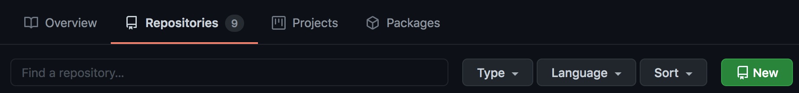
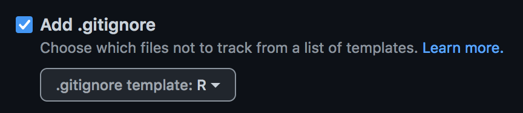
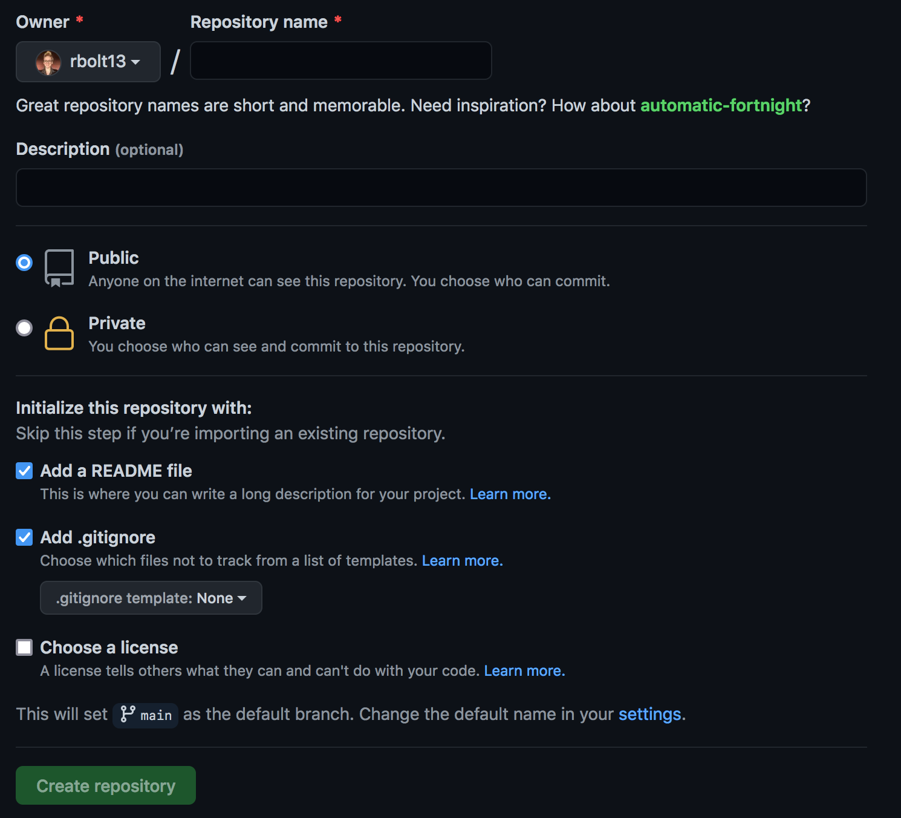
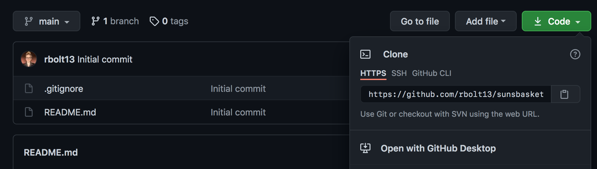
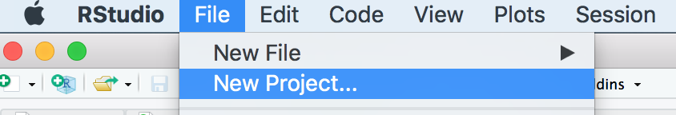
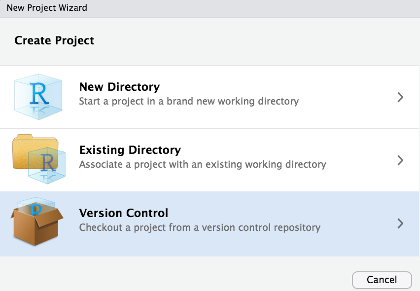
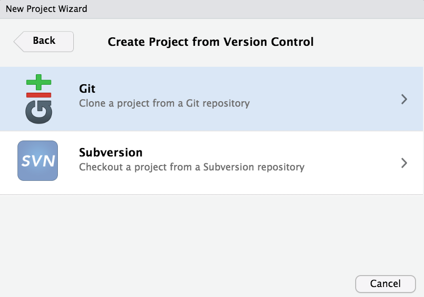
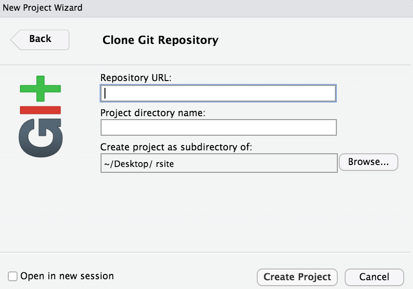

Here are my step by step instructions with pictures on how to create a website using the information provided in the links at the bottom of this page. 

# Materials Needed 

* rStudio
* GitHub Account 

1. From github create a new repository by selecting repositories, and then selecting *New*. 

On the *Create a new repository* page: 

* Fill out Repository name. (i.e. rsite or rsite2)  

* Fill out a short description of the repository. 

* Select README file and gitIgnore (make sure to select R)

* Create Repository 

Once the repository has been created, click on the green button that says **Code**, and copy the https link. 

2. Create a new Rstudio project by opening RStudio >> file >> New Project 

* Choose Version Control 

* Then Git 

* Then copy the link from github into the Reposityory URL, select where you'd like your project to be saved on your home computer, and then *Create Project*. 

Now 

Sources: 

[GitHub and RStudio](https://resources.github.com/whitepapers/github-and-rstudio/)
[Link2]()
[Link3]()

