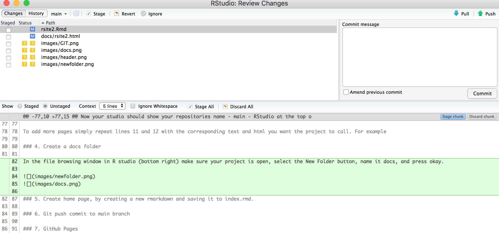

Here are my step by step instructions with pictures on how to create a website using the information provided in the links at the bottom of this page. 

##### Materials Needed 

* rStudio
* GitHub Account 

### 1. From github create a new repository by selecting repositories, and then selecting *New*. 

On the *Create a new repository* page: 

* Fill out Repository name. (i.e. rsite or rsite2)  

* Fill out a short description of the repository. 

* Select README file and gitIgnore (make sure to select R)

When I redo this page, I will discuss .gitignore more, however for now just add it because the defualt settings are nice, and will make it easier to add onto later. 

* Create Repository 

Once the repository has been created, click on the green button that says **Code**, and copy the https link. 

### 2. Create a new Rstudio project by opening RStudio >> file >> New Project 

* Choose Version Control 

* Then Git 

* Then copy the link from github into the Reposityory URL, select where you'd like your project to be saved on your home computer, and then *Create Project*. 

Now your studio should show your repositories name - main - RStudio at the top of you browser. 

### 3. Next create the sites yml by first creating a txt file with the following information:

2 | name : "Name of the website" , self explanatory 

3 | output_dir: "docs" , this is the name of the folder where the html files live. 

4 | output : html_document , this is the default and standard used. Above you will see I have a CSS code and background images to display my document over. You can use other YAML here but be careful that the index page has the same YAML, and that the YAML allows for a navbar (Pretty Docs don't seem to allow for a nav bar). 

8 | navbar: , this is the bar that goes across the top of the webpage. 

9 | title : "Summer 2021" , is the name that you want shown in the upper left corner. On this site I chose "Summer 2021" on my last site I chose my name "Randi Bolt". 

10 | left , this can be either left or right and is the side nav bar will output to (i.e. right to left or left to right).

11 | - text: "Home" , this is what is displayed in the nav bar

12 | href : index.html , this is the html file that will match the rmd file. 

To add more pages simply repeat lines 11 and 12 with the corresponding text and html you want the project to call. For example 

### 4. Create a docs folder 

In the file browsing window in R studio (bottom right) make sure your project is open, select the New Folder button, name it docs, and press okay. 

### 5. Create home page, by creating a new rmarkdown with the following header, and saving it to index.rmd. 

Now to create the first page, the home page. Below is an example of how the head of the rmarkdown file should look. Note the output is to the CSSBackground, that I do not show in this tutorial. If you use a CSS background make sure the file is saved within the project, and the file name matches what you have in your rmarkdown. 

### 6. Git push commit to main branch 

Now that the home page is created, on the top bar select the GIT button, and then commit. 

From here select all the file you wish to push, add a small comment on what you did, and then commit. After that make sure to press the Pull arrow and close the pop up when its done loading, and then Push your changes by hitting the Push button, and closing with that is done loading as well. 

Then in the upper right corner press the Pull arrow and then close, and then the Push arrow

Remember with git hub you will always commit, pull and then push. 

### 7. GitHub Pages

Now that your _ site.yml, index.Rmd, and docs folder all visable in Github it is time to activate the page it is posted on. To do so go to your codes repository, and select Settings. Scroll all the way down to the bottom of the setting page where it says *GitHub Pages* and select _Check it out here!_. 

Under Sourcw select main, and docs, and save. After you save the page will look like this below with the weblink shown in blue in the green box. 

### 8. Clean up README

With the url given in the following step, I like to then update my README page with the link to my newly created webpage, and that's it. 

# Tah Dah!!

This was the fast and dirty way to create a webpage using rstuido and github. I may update and clean this page as I create more web pages in the future, but note that this webpage is more for my notes and processes. Check the links below if you are interested in learning more.

### Adding pages

... coming soon will be a short note on adding multiple pages. 

**When first adding new pages remember to knit all pages before committing them**

Sources: 

[GitHub and RStudio](https://resources.github.com/whitepapers/github-and-rstudio/)

[Create a Website Using R](https://www.emilyzabor.com/tutorials/rmarkdown_websites_tutorial.html)

[Using Image in Rmarkdown](https://rpubs.com/thaufas/555157)

